# DRS Quiz Platform

Team project for the Distributed Computer Systems course. The goal was to build a small but realistic distributed platform with a client, two services, two databases, real-time events, and asynchronous processing. This repository contains the complete implementation plus automated CI/CD and cloud deployment (Render, Neon, Atlas) in addition to local Docker Compose.

## System Overview

- Client: Angular SPA that talks to the Main Service via REST and WebSocket.
- Main Service (Flask): authentication, user management, role changes, and WebSocket event hub. Stores users in PostgreSQL.
- Quiz Service (Flask): quiz CRUD, moderation workflow, result processing, leaderboard, and PDF reports. Stores quizzes and results in MongoDB.
- Redis: login lockouts, token revocation, and leaderboard cache invalidation.
- Internal service calls are protected with X-Internal-Token.

## Requirements -> Implementation

- Authentication: JWT login/logout, bcrypt password hashing, and temporary lockout after 3 failed attempts (Redis).
- User management: full profile data, profile edits with image, admin role changes and deletions, email notification on role change.
- Quiz lifecycle: moderators create quizzes, admins approve or reject with reason, players only see approved quizzes, moderators/admins can delete.
- Time limits: server-side validation enforces quiz duration.
- Async processing: quiz submissions are processed in background threads with a configurable delay to simulate long work.
- Real-time updates: WebSocket events for quiz creation, approval, rejection, publishing, and deletion.
- Reporting: PDF report generation for admins, delivered by email.
- Validation and DTOs: Angular form validation on the client and Marshmallow schemas as DTOs on the server.
- Data stores: PostgreSQL for users/auth (DB1) and MongoDB for quizzes/results (DB2).
- ORM/ODM: SQLAlchemy for PostgreSQL and PyMongo for MongoDB.

## Application Flow

1. Register -> receive confirmation -> login -> JWT issued.
2. Moderator creates quiz -> Quiz Service saves -> Main Service notifies admin via WebSocket.
3. Admin approves or rejects -> players see updates in real time.
4. Player solves quiz -> server validates time -> async processing -> result stored -> email sent -> leaderboard updated.
5. Admin generates report -> PDF created -> email delivered.

## Tech Stack

- Frontend: Angular, TypeScript, RxJS
- Backend: Python, Flask, Flask-JWT-Extended, Flask-SocketIO
- Databases: PostgreSQL (Neon), MongoDB (Atlas), Redis (Render Key Value)
- Infrastructure: Docker, Docker Compose, Nginx, Render
- Reporting: ReportLab (PDF)

## Local Development

1. Copy env templates:
   - backend/main-service/.env.example -> backend/main-service/.env
   - backend/quiz-service/.env.example -> backend/quiz-service/.env
2. Optional: copy root .env.example -> .env to override compose ports.
3. Run the stack:

```bash
docker compose up --build
```

Default services:

- Frontend: http://localhost:4200
- Main Service: http://localhost:5000
- Quiz Service: http://localhost:5001

Default admin (seeded on Main Service boot):

- Email: admin@quizplatform.com
- Password: value from ADMIN_PASSWORD in backend/main-service/.env

## CI/CD and Deployment

- GitHub Actions builds production Docker images for frontend and both backend services.
- Images are pushed to GitHub Container Registry (GHCR).
- Render deploy hooks pull and deploy the latest images automatically.
- Production data stores run on Neon (PostgreSQL) and MongoDB Atlas.

## Screenshots

### Authentication and Profile

Login Screen
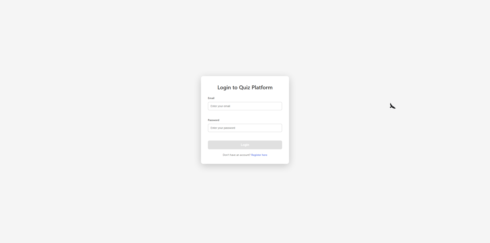

Register
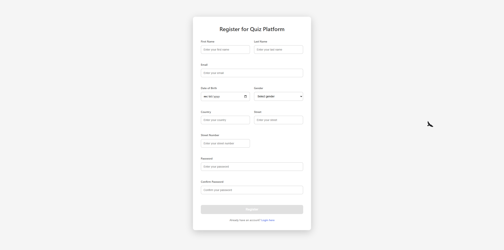

Profile
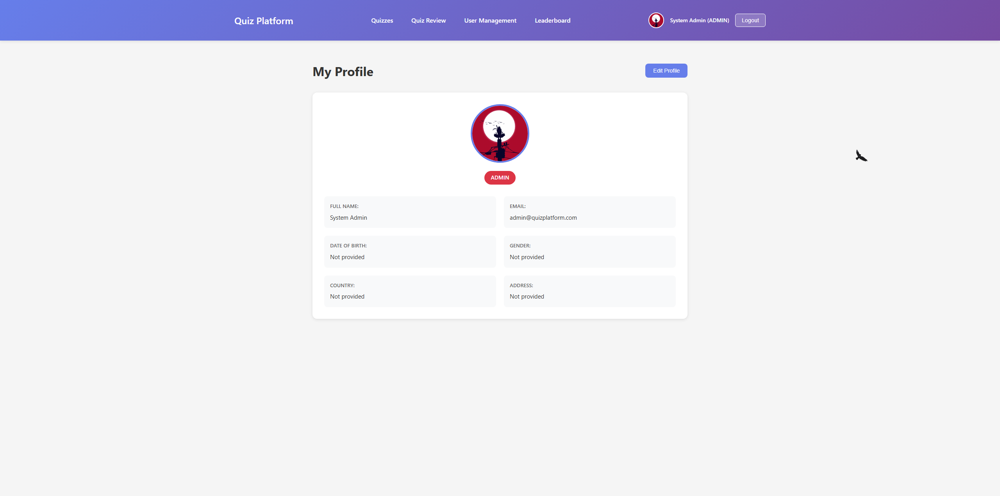

User Management
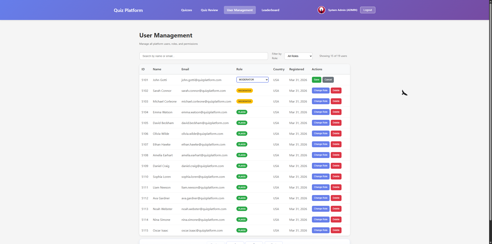

### Quiz Management

Quizzes Admin View
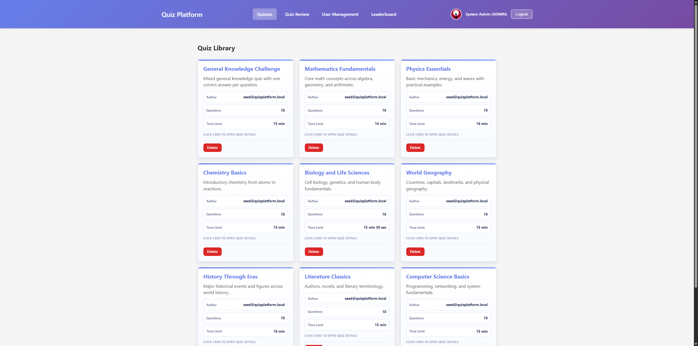

Creating Quiz
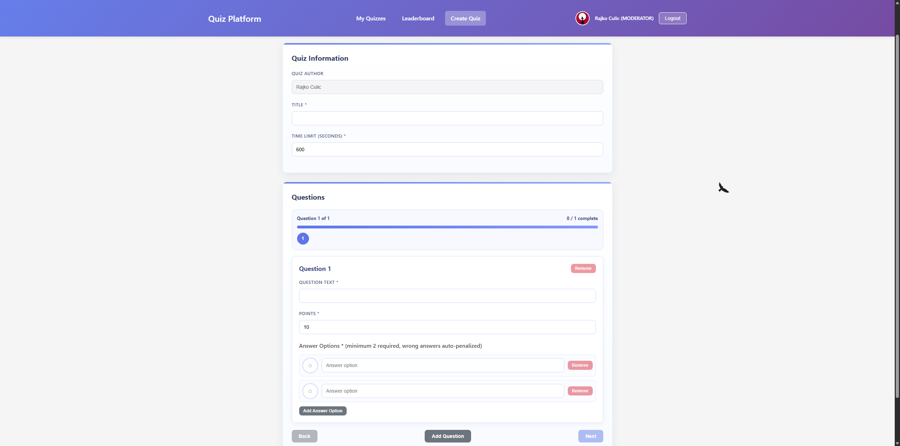

Quiz Review
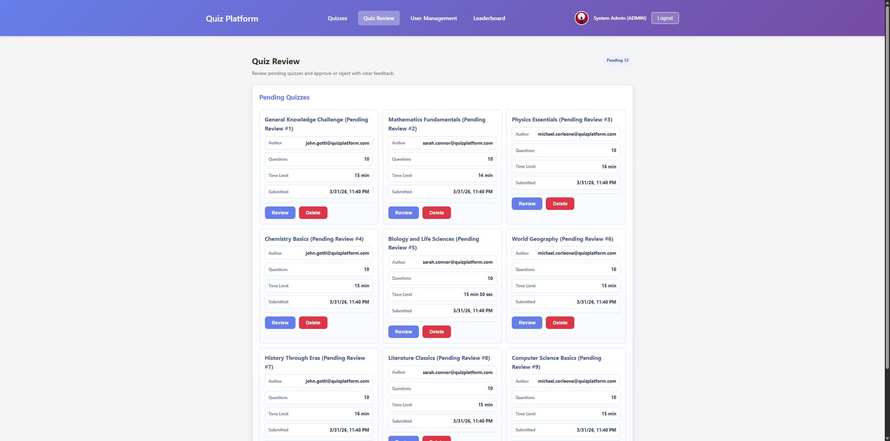

Quiz Review Card
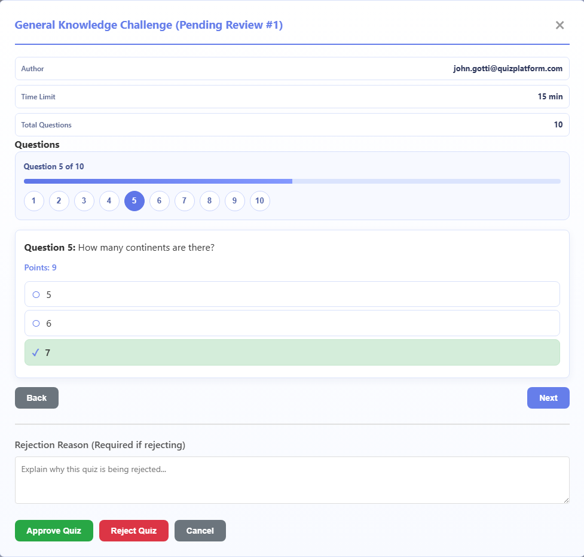

### Player Experience

Quizzes Player View
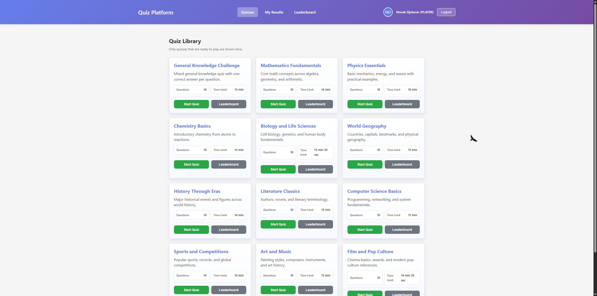

Solving Quiz
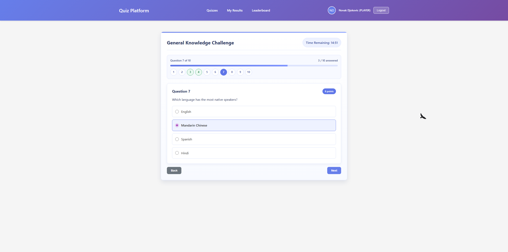

Results
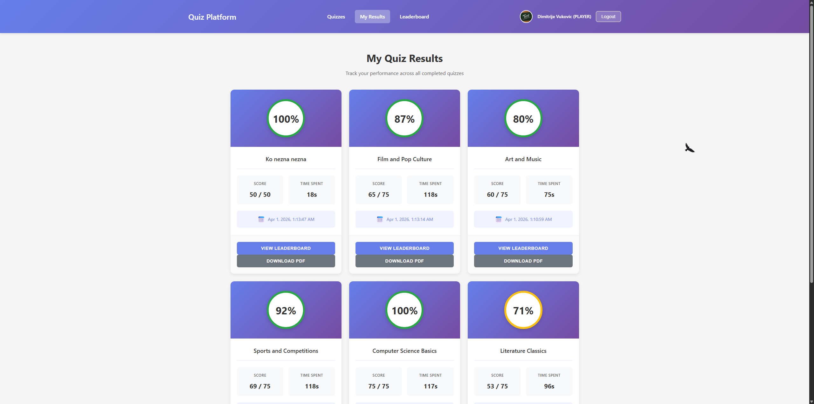

Leaderboard
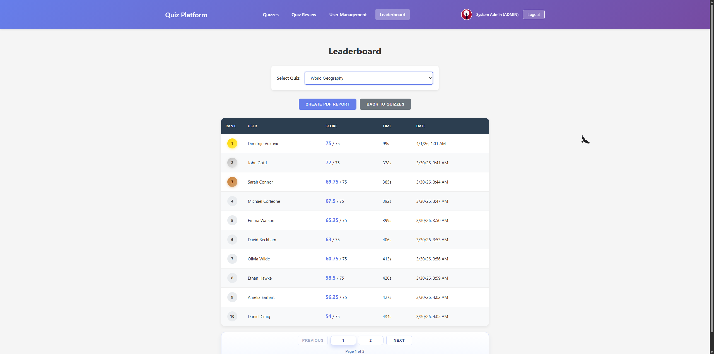

### Infrastructure and Deployment

Neon PostgreSQL
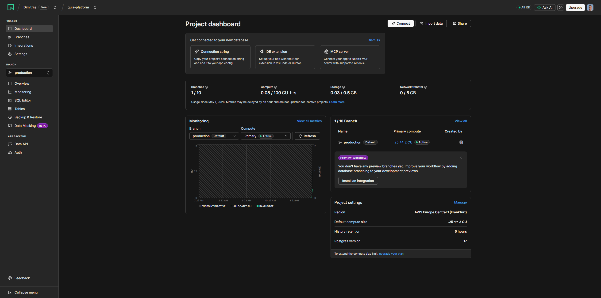

MongoDB Atlas
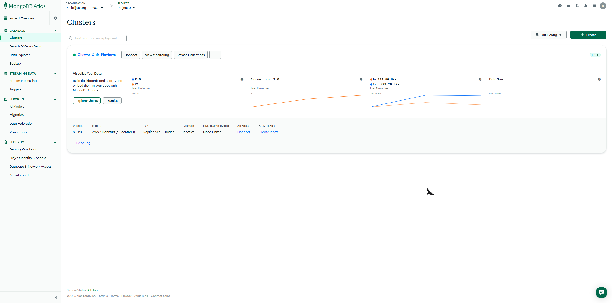

Render Deployment
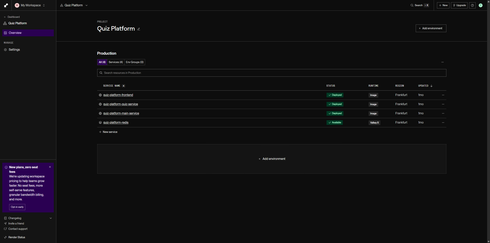

## License

MIT. See LICENSE.
